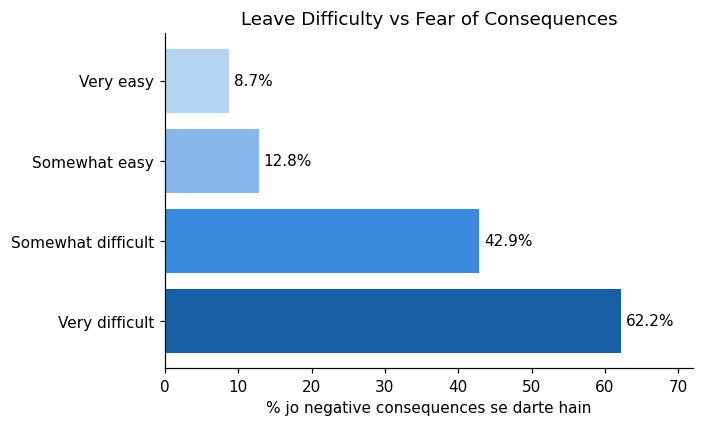

[Leave Difficulty vs Fear](images_stigma_gap_chart.png).
# mental-health-tech-survey-analysis
EDA of the OSMI Mental Health in Tech Survey (1,259 responses) — uncovering the workplace factors that drive treatment-seeking, with business recommendations. Python, pandas, matplotlib.

